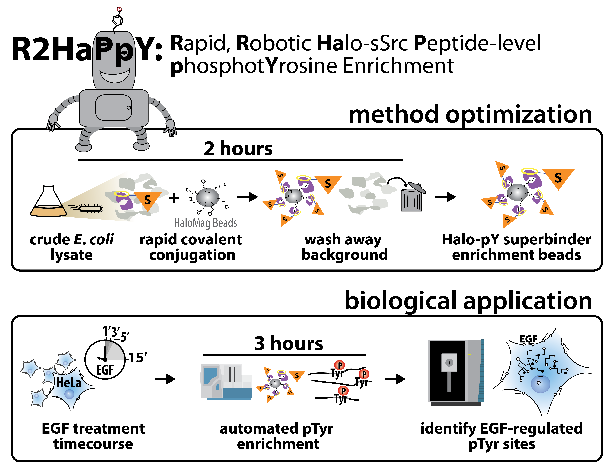

# Phosphotyrosine Proteomics Using a Scalable SH2 Superbinder Enrichment Strategy

This repository contains all analysis scripts, figure-generation code, and search results used to reproduce the results of the manuscript:

**“Phosphotyrosine Proteomics Using a Scalable SH2 Superbinder Enrichment Strategy.”**
**[BioRxiv Preprint](https://www.biorxiv.org/content/10.1101/2025.05.14.653984v1)**




The codebase includes:
- R scripts used to process phosphoproteomics, global phosphoproteome, and proteome datasets for both method optimization and biological application.  
- Figure-generation pipelines for all Main Figures and Supplementary Figures  
- Processed data tables required for reproducing plots  

Large raw CSV files (Comet search results, Ascore outputs, FASTA files, etc.) are not stored in the repository due to GitHub file-size limits, but are provided as release assets (see “Data availability” below).
 - Additionally, directory structure for code outputs is included in the zipped file to be downloaded from `Releases`
 
 
 
## 🚀 Quick Start: Generate All Figures

Download the zip file containing folders raw_data/, output/, and modified_data/ from `Releases` and place in this R project directory.
Then, run these two commands in your R console (inside the R project):

```r
renv::restore()
source("00_master_run_all_figures.R")
```


---

## Interactive Dataset

An interactive, browser-based version of the full R2HaPpY dataset is hosted at:

➡ **https://r2happy.gs.washington.edu**

This site allows exploration of phosphorylation patterns, gene-level filtering, replicate variability, and downstream functional annotation analyses from the EGF stimulation timecourse of HeLa cells.

---

## Protocols

The full experimental workflow, including SH2 Superbinder expression, bead preparation, enrichment, and LC-MS/MS acquisition is documented on protocols.io:

➡ **[Protocols.io Link](https://www.protocols.io/private/48FD48C3977A11F0A3900A58A9FEAC02)**

---

## Data availability

Raw phosphoproteomics and proteome CSVs for all figures are provided as release assets:

- **[Download R2HaPpY raw data (v1.0)](https://github.com/alexis-cmyk/ManuscriptCodeShare_R2HaPpY/releases/tag/v1.0.1-InputData_and_OutputFolders)**

Each archive contains the full set of raw search engine outputs (Comet), AScore assignments, peptide-level redundancy tables, and meta-data required to reproduce the manuscript analyses.

Processed and intermediate data tables used in the figure-generation scripts (e.g., scaled intensities, summarized peptide tables, cluster assignments) are included directly in this repository under the `modified_data/` subdirectory.

---

## Reproducing figures

All figures in the manuscript reliant on custom code can be regenerated using:
- Download and unzip file from Releases section into your local clone of this RProject: *raw_data/*, *output/*, *modified_data/*
  - **TIP** *output/* and *modified_data/* folders are empty, while *raw_data/* is populated.

- Individual figure-specific scripts can be run in isolation.
  - Figures are deposited into figure-specific sub-directories within `output`
  - Tables are deposited into figure-specific sub-directories within `modified_data`

- To generate all figures with one command, in console within this Rproject, run: `source("00_master_run_all_figures.R")`
  - This file points to each figure specific script: `R/00_master_run_all_figures.R`

- The Shiny application enabling interactive re-analysis and visualization **[here](https://r2happy.gs.washington.edu)**

---
## Dependencies

Dependencies are managed using **renv**.  
To reproduce the full environment:


```{r}
renv::restore()
```
---
### 🔧 Reproducing the R Environment (renv)

This project uses renv to provide a fully reproducible R environment, including exact package versions for **R 4.5.1** and **Bioconductor 3.22**.
To recreate the environment on any system:

#### 1. Install the required R version

This project was developed using:

- **R 4.4.2**

- **Bioconductor 3.22**

  - Download R 4.5.1: https://https://cran.r-project.org/bin/windows/base/old/4.4.2/

    - Using the matching R version ensures renv::restore() works without package conflicts.

#### 2. Install renv and yaml

_Inside R (from the project directory), run:_
`source("00_setup_environment.R")`

- restart R

#### 3. Restore the environment

_Run:_

`renv::restore()`


_This will:_

- Read the renv.lock file

- Install all required CRAN and Bioconductor packages

- Recreate the exact software environment used for all analyses and figures

#### 4. After renv::restore() finishes successfully, run:

source("00_master_run_all_figures.R")

- This runs all scripts to generate figures and places them in the directory structure you should have unzipped from Releases.


---
## Contact Information

Alexis Chang, code author, Graduate Student

Judit Villen Laboratory

Genome Sciences, University of Washington, Seattle

**[See more from the Villen lab ](https://villenlab.gs.washington.edu/wordpress/)**